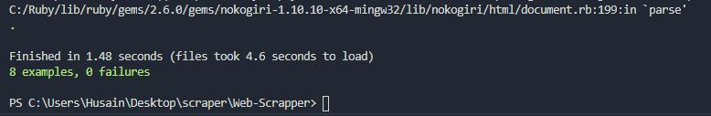

# RUBY Capstone project - Webscrapping

Developing a Web scraping/web harvesting, or web data extraction used for extracting data from websites. Currently, the app is used to automate the processe of scraping the data from webapp. In this project, we will be scrapping Utorrent webapp.

## 🔧 Built With

- Ruby.
- Using Rubocop Linters.
- terminal-table
- nokogiri
- httparty

## 🛠 Getting Started

## Install

You can run these functions in you own local environment. In order to run, you need to install Ruby in your computer. For windows you can go to [Ruby installer](https://rubyinstaller.org/) and for MAC and LINUX you can go to [Ruby official site](https://www.ruby-lang.org/en/downloads/) for intructions on how to intall it. Then you can clone the project by typing `https://github.com/bmuhamood/Web-Scrapper.git`

To get a local copy up and running follow these simple example steps.

- Go to the main page of the repo.
- Press the "Code" button and get the repo link.
- Clone it using git.

## Running tests with Rspec

The methods were tested with Rspec which is a computer domain-specific language (DSL) testing tool written in programming language Ruby to test Ruby code. It is a behavior-driven development (BDD) framework which is extensively used in production applications.

## How to install Rspec

- In the terminal, type `gem install rspec`
- Once done, go to project directory and type `rspec --init`
- You will see a folder `spec` and a file `.rspec`
- Inside spec folder you'll see a `spec_helper.rb` file.

## How to run Rspec

- In the terminal from the project repository, type `rspec` and all test Units will be displayed as per the below image

## How to Install required Bundle and get the scrapping tool running

From the project repository.

- In the Terminal, Run `bundle install`
- Then cd `bin`
- Run `ruby main.rb`
- Place `Enter` two times for the program to run

# Authors

👤 Bbosa Muhamood

- Github: [@bmuhamood](https://github.com/bmuhamood)
- Twitter: [@croixtechfirm](https://twitter.com/croixtechfirm)
- Linkedin: [Bbosa Muhamood](https://www.linkedin.com/in/bbosa-muhamood-06845576/)

### 🤝 Contributing

Contributions, issues and feature requests are welcome!
